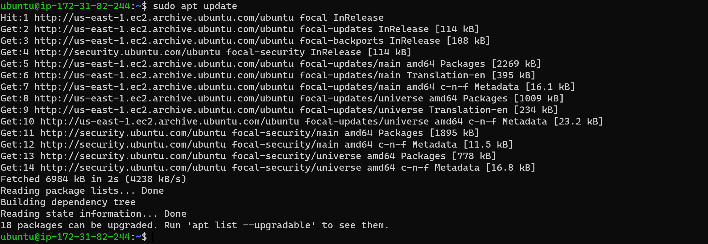
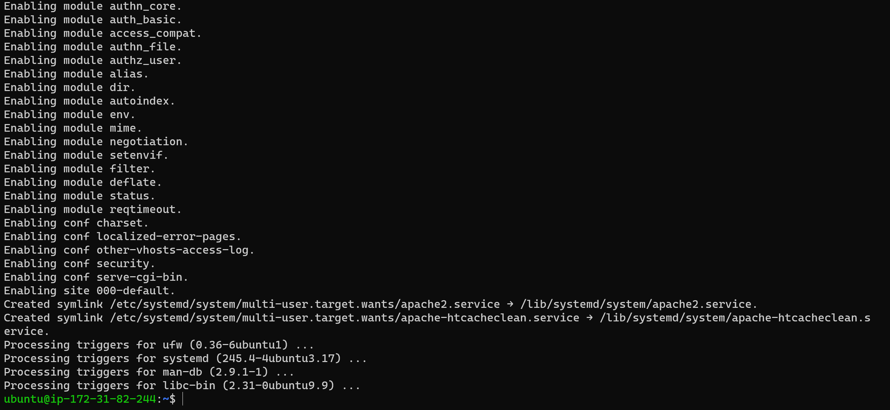
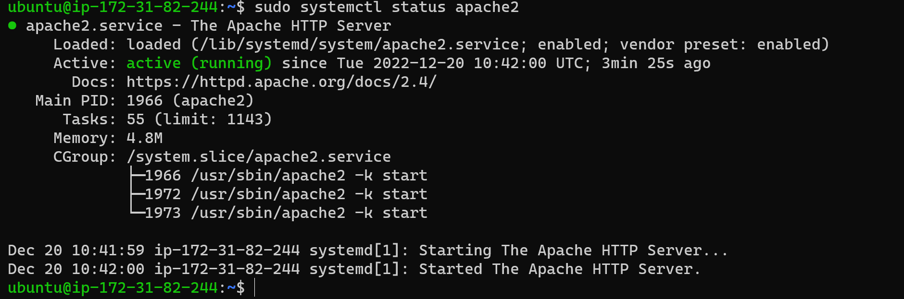

## **WEB STACK IMPLEMENTATION IN AWS**

#### A technology stack is a set of frameworks and tools used to develop a software product. This set of frameworks and tools are very specifically chosen to work together in creating a well-functioning software.

###  **_Installing Apache and updating Firewall_**

update a list of packages in package manager

`sudo apt update`

run apache2 package installation

`sudo apt install apache2`

To verify that apache2 is running as a Service in our OS, use following command

`sudo systemctl status apache2`

