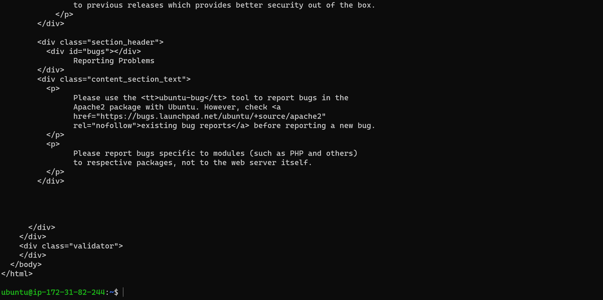
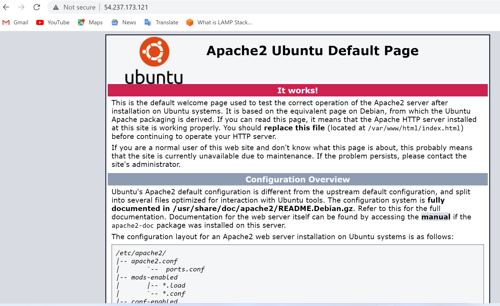

## **WEB STACK IMPLEMENTATION IN AWS**

#### A technology stack is a set of frameworks and tools used to develop a software product. This set of frameworks and tools are very specifically chosen to work together in creating a well-functioning software.

###  **_Installing Apache and updating Firewall_**

update a list of packages in package manager

`sudo apt update`

run apache2 package installation

`sudo apt install apache2`

To verify that apache2 is running as a Service in our OS, use following command

`sudo systemctl status apache2`

Our server is running and we can access it locally and from the Internet (Source 0.0.0.0/0 means ‘from any IP address’).

we then access our server locally in the ubuntu shell by running the following

`curl http://localhost:80`

Open a web browser of your choice and try to access following url to ensure its working, we can pick 
http://<Public-IP-Address>:80

If you see following page, then your web server is now correctly installed and accessible through your firewall.

