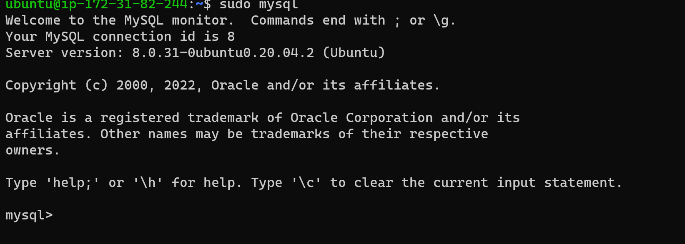
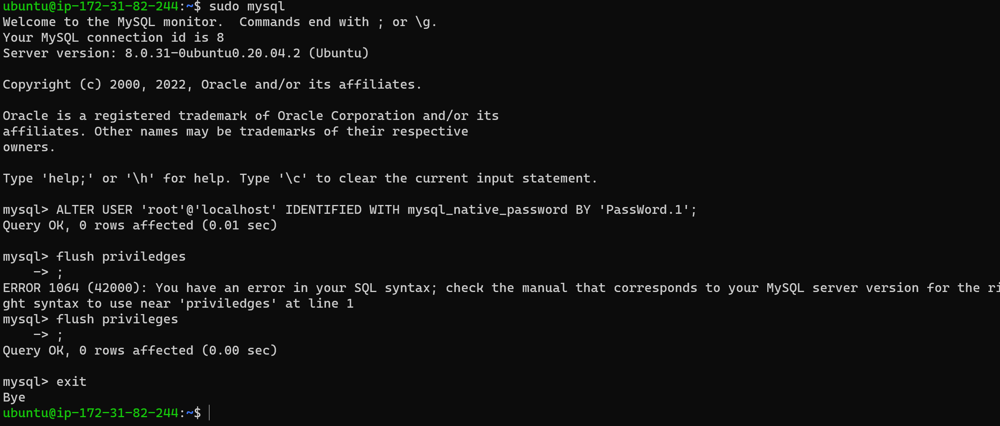
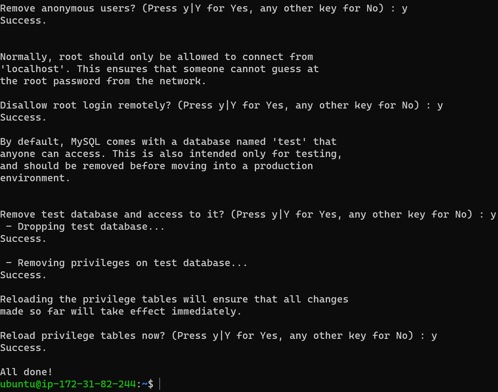

## **WEB STACK IMPLEMENTATION IN AWS**

#### A technology stack is a set of frameworks and tools used to develop a software product. This set of frameworks and tools are very specifically chosen to work together in creating a well-functioning software.

###  **_INSTALLING APACHE AND UPDATING FIREWALL_**

update a list of packages in package manager

`sudo apt update`

run apache2 package installation

`sudo apt install apache2`

To verify that apache2 is running as a Service in our OS, use following command

`sudo systemctl status apache2`

Our server is running and we can access it locally and from the Internet (Source 0.0.0.0/0 means ‘from any IP address’).

we then access our server locally in the ubuntu shell by running the following

`curl http://localhost:80`

Open a web browser of your choice and try to access following url to ensure its working, we can pick 
http://<Public-IP-Address>:80

If you see following page, then your web server is now correctly installed and accessible through your firewall.

###  **_INSTALLING MYSQL_**

MySQL is a popular relational database management system used within PHP environments, so we will use it in this project

To install mysql, use the following command

`sudo apt install mysql-server`

When prompted, confirm installation by typing Y, and then ENTER.

 When the installation is finished, log in to the MySQL console by typing:
  
   `sudo mysql`

This will connect to the MySQL server as the administrative database user root, which is inferred by the use of sudo when running this command. 
You should see       output like this:

It’s recommended that you run a security script that comes pre-installed with MySQL. This script will remove some insecure default settings and lock down access to your database system. Before running the script you will set a password for the root user, using mysql_native_password as default authentication method. We’re defining this user’s password as PassWord.1

`ALTER USER 'root'@'localhost' IDENTIFIED WITH mysql_native_password BY 'PassWord.1';`

 Exit the MySQL shell with:

 `mysql> exit`

 

  Start the interactive script by running:
  `sudo mysql_secure_installation`

  

  
  This will ask if you want to configure the VALIDATE PASSWORD PLUGIN.

  ##Enabling this feature is something of a judgment call. If enabled, passwords which don’t match the specified criteria will be rejected by MySQL with an error.

  It is safe to leave validation disabled, but you should always use strong, unique passwords for database credentials

  Answer Y for yes, or anything else to continue without enabling

  If you answer “yes”, you’ll be asked to select a level of password validation. Keep in mind that if you enter 2 for the strongest level, you will receive errors     when attempting to set any password which does not contain numbers, upper and lowercase letters, and special characters,or which is based on common dictionary words e.g PassWord.1

   For the rest of the questions, press Y and hit the ENTER key at each prompt. This will prompt you to change the root password, remove some anonymous users and the   test database, disable remote root logins, and load these new rules so that MySQL immediately respects the changes you have made

   When you’re finished, test if you’re able to log in to the MySQL console by typing

   `sudo mysql -p`

   To exit the MySQL console, type:

   `mysql> exit`

    Notice that you need to provide a password to connect as the root user.
  
  MySQL server is now installed and secured